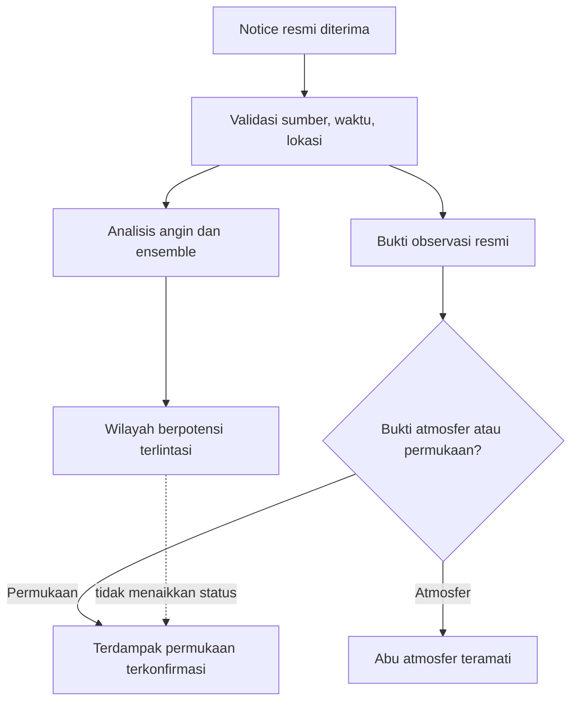
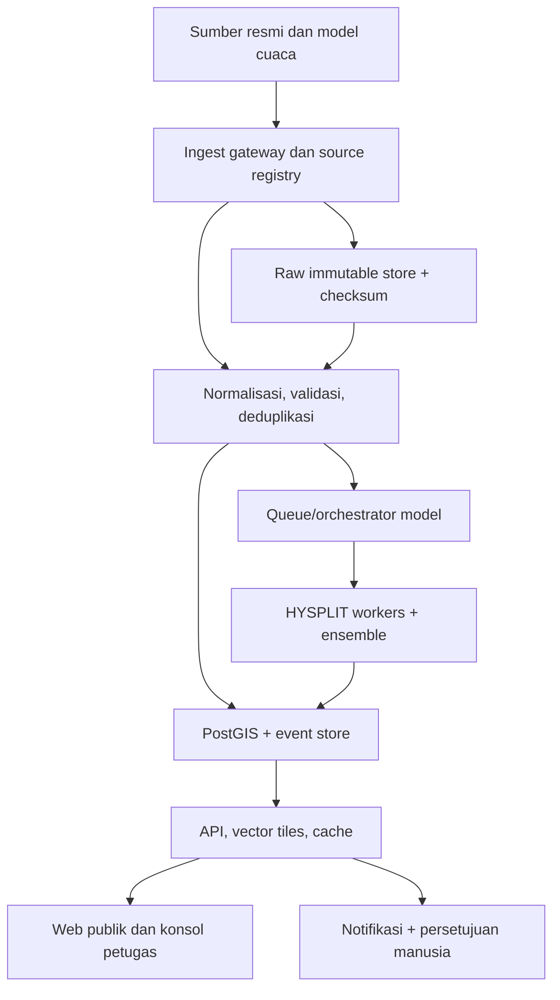

# Rancangan aplikasi web pemantauan abu vulkanik Indonesia

**Versi:** 1.0 — studi kelayakan dan rancangan teknis  
**Tanggal verifikasi sumber:** 21 September 2026 (UTC)  
**Status:** rancangan; belum merupakan sistem operasional atau peringatan resmi  
**Cakupan:** Indonesia, abu vulkanik di atmosfer dan potensi deposisi permukaan, angin multilapis, cuaca, serta estimasi wilayah administratif yang berpotensi terlintasi

> **Peringatan penggunaan:** produk yang dirancang di dokumen ini tidak menggantikan PVMBG/Badan Geologi, BMKG, VAAC, BNPB/BPBD, AirNav Indonesia, regulator penerbangan, atau keputusan otoritas setempat. Keluaran model harus selalu diberi label **INDIKASI MODEL**, bukan fakta kejadian atau peringatan resmi.

## 1. Ringkasan keputusan

Aplikasi layak dibangun sebagai **platform fusi bukti dan dukungan keputusan mendekati waktu nyata**, bukan sebagai alat yang mengklaim mendeteksi atau memprediksi abu secara mandiri. Sumber kejadian utama adalah VONA/MAGMA PVMBG; cuaca permukaan dan nowcast berasal dari BMKG; medan meteorologi tiga dimensi untuk pemodelan dapat berasal dari NOAA GFS/NOMADS; HYSPLIT dipasang sendiri untuk simulasi dispersi; VAAC Darwin menjadi rujukan resmi abu untuk penerbangan; NASA Worldview/GIBS menjadi lapisan visual pendukung. Open-Meteo cocok untuk prototipe, tetapi penggunaan produksi harus mengikuti lisensi dan tingkat layanan.

MVP harus lebih dahulu menampilkan kejadian resmi, profil angin multilapis, umur data, tautan sumber, dan overlay wilayah **berpotensi terlintasi**. Status **terkonfirmasi terdampak di permukaan** hanya boleh muncul bila ada observasi atau pernyataan resmi tentang jatuhan abu. Arah angin dan lintasan partikel tidak cukup untuk menyatakan dampak. Bila laju emisi abu tidak tersedia, model memakai sumber satuan dan hanya menghasilkan footprint relatif/probabilistik, bukan konsentrasi atau ketebalan endapan.

Arsitektur yang disarankan: MapLibre/React, API Python, PostGIS, object storage untuk data mentah dan GRIB, antrean worker, HYSPLIT terkontainerisasi, cache, audit log, dan persetujuan manusia sebelum publikasi notifikasi. MVP-pilot diperkirakan 12–16 minggu. Estimasi biaya dalam dokumen adalah proxy anggaran, bukan harga pasar atau penawaran.

### Terverifikasi dalam studi ini

- Dokumentasi terbuka BMKG untuk prakiraan cuaca JSON dan nowcast CAP/XML, termasuk frekuensi, batas akses, serta atribusi.
- Halaman publik VONA/MAGMA, isi contoh VONA, tinggi kolom ASL, arah gerak teramati, dan langganan email.
- Peran dan halaman advisory VAAC Darwin; pada saat pemeriksaan halaman menampilkan nihil advisory Darwin dalam 24 jam terakhir.
- Ketersediaan GFS/GDAS 0,25° melalui NOMADS dan siklus enam-jamannya.
- Kemampuan serta keterbatasan HYSPLIT/READY, termasuk sumber satuan ketika massa abu tidak diketahui.
- Variabel pressure-level, geopotential height, batas pemakaian gratis, dan lisensi Open-Meteo.
- Kemampuan NASA Worldview/GIBS dan batas akses HimawariCloud.
- Keberadaan portal Kebijakan Satu Peta BIG dan pembatasan hak akses tertentu.

### Belum terverifikasi atau belum lulus uji langsung

- Endpoint data langsung BMKG dan Open-Meteo tidak dapat diakses dari lingkungan pengujian ini karena diblokir klien/jaringan; dokumentasinya tersedia, tetapi respons aktual harus diuji dari lingkungan deployment.
- Tidak ditemukan dokumentasi API publik resmi untuk MAGMA/VONA atau feed otomatis VAAC Darwin pada halaman yang diperiksa.
- Hak redistribusi, SLA, dan mekanisme akses mesin untuk data MAGMA, VAAC, batas administrasi BIG, peta KRB, dan data kependudukan perlu persetujuan tertulis.
- Produk satelit yang secara algoritmik membedakan abu dari awan, asap, debu, dan SO₂ belum dipilih atau divalidasi untuk Indonesia.
- Tidak ada ambang konsentrasi/deposisi untuk risiko kesehatan yang ditetapkan dalam rancangan ini.

## 2. Snapshot fakta saat verifikasi

Snapshot ini hanya membuktikan bahwa sumber publik memuat data; **bukan status operasional setelah 21 September 2026**.

- [VONA MAGMA](https://magma.esdm.go.id/vona) memuat VONA Semeru 20 September 2026 22:25 UTC. [Dokumen VONA tersebut](https://magma.esdm.go.id/vona/d58d4209-0b19-4954-b74c-d98429784a0b) menyebut puncak awan abu sekitar 4.076 m ASL, 400 m di atas puncak, bergerak ke timur laut, berdasarkan pengamat darat. Ada inkonsistensi satuan di dokumen sumber: 13.043 ft secara aritmetis sekitar 3.976 m, bukan 4.076 m; sedangkan 3.676 m + 400 m = 4.076 m. Sistem harus menyimpan nilai asli, menandai konflik, dan meminta verifikasi—bukan mengoreksi sumber secara diam-diam.
- [Halaman advisory VAAC Darwin](https://www.bom.gov.au/aviation/volcanic-ash/darwin-va-advisory.shtml) pada saat pemeriksaan menampilkan “Nil current Darwin Volcanic Ash Advisories” untuk 24 jam terakhir. Ini tidak otomatis membantah VONA: VONA dan VAA berbeda tujuan, wilayah, waktu terbit, serta kriteria penerbitan.
- Perbedaan antarsumber harus ditampilkan sebagai fakta yang berdampingan, bukan diselesaikan diam-diam oleh aplikasi.

## 3. Matriks inventaris sumber

### 3.1 Sumber inti

| Data | Pengelola dan sumber | Akses/format yang didokumentasikan | Cakupan dan frekuensi | Lisensi/atribusi | Status pengujian | Risiko dan fallback |
|---|---|---|---|---|---|---|
| Kejadian, tinggi/arah kolom abu, kode warna penerbangan | PVMBG/Badan Geologi — [VONA MAGMA](https://magma.esdm.go.id/vona) | Laman web publik; langganan email disebut tersedia. API publik tidak ditemukan | Gunung api Indonesia; terbit saat ada notice/perubahan | Hak redistribusi otomatis belum ditemukan; tautkan dokumen asli dan minta izin | Halaman serta satu dokumen detail berhasil dibaca; API **tidak tersedia/ tidak terdokumentasi** | Jangan scraping tanpa izin. MVP: entri manual dua-petugas atau email resmi yang diarsipkan; fase lanjut: feed resmi/perjanjian data |
| Aktivitas, laporan, peta KRB | PVMBG/MAGMA — [portal utama](https://magma.esdm.go.id/) | Laman/download; rincian API dan lisensi mesin belum terverifikasi | Nasional; frekuensi menurut jenis laporan | Belum terverifikasi | Halaman publik teridentifikasi | Simpan URL sumber, versi, waktu unduh, checksum; impor hanya setelah hak penggunaan jelas |
| Prakiraan cuaca desa | BMKG — [dokumentasi API](https://data.bmkg.go.id/prakiraan-cuaca/) | JSON; `https://api.bmkg.go.id/publik/prakiraan-cuaca?adm4={kode}` | 3 hari; 8 titik/hari atau 3-jam; pembaruan 2 kali/hari; kode ADM4 | Atribusi BMKG wajib; 60 permintaan/menit/IP | Dokumentasi terverifikasi; endpoint langsung **belum lulus uji konektivitas lingkungan ini** | Cache terpusat, hanya wilayah aktif, backoff pada 429; matikan konektor bila kontrak berubah |
| Peringatan dini cuaca | BMKG — [dokumentasi CAP](https://data.bmkg.go.id/peringatan-dini-cuaca/) | RSS/XML daftar; CAP/XML detail; endpoint `https://www.bmkg.go.id/alerts/nowcast/id` | Nasional hingga kecamatan; pembaruan “setiap saat”; polygon tersedia | Atribusi BMKG wajib; 60 permintaan/menit/IP | Dokumentasi terverifikasi; endpoint langsung **belum lulus uji konektivitas** | Poll hemat 60–120 detik, validasi XSD/struktur, simpan CAP mentah; peringatan kosong ≠ konektor sehat |
| Advisory/poligon abu penerbangan | Bureau of Meteorology — [Darwin VAAC](https://www.bom.gov.au/aviation/volcanic-ash/) dan [advisory](https://www.bom.gov.au/aviation/volcanic-ash/darwin-va-advisory.shtml) | Laman publik; feed/API otomatis belum terverifikasi | Area tanggung jawab termasuk Indonesia; penerbitan berbasis kejadian | Halaman menyatakan produk untuk industri penerbangan; akses/redistribusi mesin perlu konfirmasi ke penyedia | Halaman berhasil dibaca | MVP: tautan dan input operator; fase lanjut: perjanjian feed. Jangan gunakan untuk flight planning konsumen |
| Medan cuaca 3-D | NOAA/NCEP — [NOMADS](https://nomads.ncep.noaa.gov/) | GRIB2 via grib filter/HTTPS | GFS/GDAS 0,25°; siklus 6 jam; produk GFS 0,25° hourly tersedia | Ketentuan NOAA perlu dicatat dalam data registry; endpoint file aktual perlu uji | Katalog resmi terverifikasi; unduhan GRIB **belum diuji di lingkungan ini** | Subset bbox/variabel, checksum, simpan cycle ID; Open-Meteo sebagai fallback prototipe, bukan pengganti otoritatif |
| Angin pressure-level cepat untuk prototipe | Open-Meteo — [API docs](https://open-meteo.com/en/docs), [terms](https://open-meteo.com/en/terms) | JSON `/v1/forecast`; pressure levels, geopotential height, hujan | Hingga 16 hari; model dapat dipilih; default `best_match` menggabungkan model | Gratis nonkomersial: <10.000/hari, 5.000/jam, 600/menit; CC BY 4.0; komersial perlu paket berbayar | Dokumentasi/terms terverifikasi; endpoint **belum lulus uji konektivitas** | Kunci model secara eksplisit, simpan model/run; jangan bergantung pada best-match tanpa provenance; produksi memakai paket sesuai lisensi atau NOAA langsung |
| Dispersi/transport/deposisi | NOAA ARL — [HYSPLIT](https://www.arl.noaa.gov/hysplit/) dan [model abu](https://www.arl.noaa.gov/hysplit/volcanic-ash-model/) | Perangkat lunak/model; layanan READY web | Trajektori, dispersi, deposisi; konfigurasi lokal memberi opsi penuh | Registrasi/ketentuan distribusi perangkat lunak dan meteorologi harus dipenuhi | Dokumentasi terverifikasi; model lokal belum diinstal dalam studi ini | Produksi: self-hosted, versi dikunci, regression test. [READY](https://www.ready.noaa.gov/READYVolcAsh.php) bukan lingkungan operasional 24/7 dan tidak menjamin ketepatan waktu |

### 3.2 Sumber pendukung

| Data | Sumber | Fakta terverifikasi | Peran yang aman | Kesenjangan |
|---|---|---|---|---|
| Citra satelit dan kejadian | NASA — [Worldview/GIBS](https://www.earthdata.nasa.gov/data/tools/worldview) | >1.200 produk visual; banyak tersedia dalam hitungan jam; citra geostasioner 10-menit untuk 90 hari; GIBS dapat diintegrasikan | Pemeriksaan visual, replay historis, konteks awan/SO₂/kejadian | Pilih produk ash-specific, QA flag, lisensi/atribusi, dan validasi lokal sebelum menyebut deteksi abu |
| Himawari resolusi temporal tinggi | JMA — [HimawariCloud](https://www.data.jma.go.jp/mscweb/en/himawari89/cloud_service/cloud_service.html) | Hanya NMHS; full disk 10 menit, target area 2,5 menit; data dihapus setelah 72 jam | Integrasi institusional melalui BMKG/JMA pada fase lanjut | Bukan API publik aplikasi; memerlukan akun NMHS dan kapasitas data besar |
| Batas, KRB, infrastruktur | BIG — [Kebijakan Satu Peta](https://onemap.big.go.id/) | Portal memuat tema batas wilayah dan KRB; beberapa hak akses diatur untuk walidata | Referensi dataset resmi dan proses perjanjian | Endpoint, versi, hak redistribusi, dan akses publik per-layer belum terverifikasi |
| Populasi | BPS/instansi resmi | Belum ada API publik yang berhasil diverifikasi dalam studi ini | Upload tabel resmi terversi oleh operator; agregasi non-real-time | Tahun referensi, perubahan batas, lisensi dan pemetaan kode wilayah harus ditetapkan |
| Topografi | BIG atau DEM dengan lisensi jelas | Sumber final belum dipilih | Menghapus pressure level di bawah tanah; perhitungan elevasi | Datum vertikal, resolusi, void, dan hak penggunaan perlu uji penerimaan |

### 3.3 Registry wajib untuk setiap sumber

Setiap konektor memiliki entri `source_registry`: pemilik, URL dokumentasi, URL endpoint, format, skema, autentikasi, batas akses, lisensi, teks atribusi, tujuan penggunaan, zona waktu, frekuensi, `last_verified_at`, kontak pemilik, status legal, status uji konektivitas, serta fallback. Konektor tidak boleh aktif produksi jika `legal_status != approved` atau contract test gagal.

## 4. Model konseptual: fakta, model, dan status dampak

### 4.1 Jenis bukti

| Kode | Jenis | Contoh | Yang boleh disimpulkan |
|---|---|---|---|
| `OBS-VOLCANO` | Pengamatan/notice vulkanologi resmi | VONA PVMBG | Letusan/awan abu dilaporkan sesuai waktu, metode dan keterbatasan sumber |
| `ADV-AIRSPACE` | Advisory resmi penerbangan | VAA/VAG VAAC | Abu teramati atau diprakirakan di ruang udara menurut advisory; **bukan otomatis jatuhan permukaan** |
| `OBS-GROUND` | Observasi resmi permukaan | Laporan instansi mengenai jatuhan abu | Lokasi/waktu yang disebut dapat berstatus terkonfirmasi permukaan |
| `OBS-SAT` | Retrieval satelit tervalidasi | Produk ash-specific dengan QA | Abu atmosfer pada piksel/waktu yang memenuhi kualitas; tidak sama dengan deposisi |
| `FCST-MET` | Prakiraan meteorologi | GFS/BMKG/Open-Meteo | Kondisi atmosfer prakiraan; bukan keberadaan abu |
| `MODEL-TRAJ` | Trajektori parcel udara | HYSPLIT trajectory | Jalur massa udara; bukan volume abu dan bukan konsentrasi |
| `MODEL-DISP` | Simulasi dispersi/deposisi | HYSPLIT ensemble | Area kemungkinan menurut input/asumsi; status tetap indikasi model |
| `REPORT-UNVERIFIED` | Laporan warga/media | Foto/pesan | Petunjuk untuk verifikasi; tidak boleh menaikkan status publik |

### 4.2 Definisi status yang ditampilkan

- **Terpantau resmi:** terdapat notice atau observasi resmi yang valid dan belum dibatalkan/dikedaluwarsakan. Label menyebut sumber, waktu terbit, dan usia data.
- **Abu atmosfer teramati resmi:** sumber resmi menyatakan abu terlihat/terdeteksi pada lokasi atau poligon tertentu. Ini tidak menyatakan permukaan terkena jatuhan.
- **Berpotensi terlintasi:** footprint ensemble model atau lintasan screening memotong wilayah pada interval waktu tertentu. Label wajib: **INDIKASI MODEL — bukan konfirmasi abu**.
- **Potensi deposisi model:** model fisik dengan deposisi aktif menunjukkan deposisi relatif/probabilistik. Tanpa source term massa tervalidasi, tidak tampilkan satuan konsentrasi, massa per luas, atau ketebalan.
- **Terkonfirmasi terdampak permukaan:** ada laporan resmi/observasi terverifikasi tentang jatuhan abu pada wilayah dan rentang waktu itu. Operator manusia menghubungkan bukti ke polygon/point dan menyetujui publikasi.
- **Tidak ada data** berbeda dari **tidak terdampak**. UI tidak boleh menyamakan keduanya.

### 4.3 Alur perubahan status



Semua status memiliki periode berlaku. Pembaruan baru tidak menimpa bukti lama; sistem membuat versi dan hubungan `supersedes` agar evolusi dapat diaudit.

## 5. Kebutuhan pengguna dan rancangan pengalaman

### 5.1 Peran

| Peran | Kebutuhan utama | Hak penting |
|---|---|---|
| Publik | Melihat informasi resmi, usia data, potensi model tanpa jargon | Baca; tidak melihat kontrol internal atau laporan belum diverifikasi |
| Petugas BPBD/BNPB | Memahami wilayah berpotensi, ketidakpastian, cuaca dan perubahan siklus | Baca rinci, ekspor, berlangganan notifikasi internal |
| Analis vulkanologi/meteorologi/GIS | Memeriksa sumber, profil vertikal, model run, konflik, serta kualitas | Menjalankan skenario, memberi catatan, mengusulkan status |
| Approver | Mencegah publikasi klaim yang belum didukung | Menyetujui/menolak notifikasi dan status terkonfirmasi |
| Administrator data | Menjaga konektor, lisensi, kode wilayah dan audit | Konfigurasi dengan prinsip least privilege |

### 5.2 Layar utama

| Layar | Bagian utama | Guardrail komunikasi |
|---|---|---|
| Peta nasional | Gunung, daftar kejadian, waktu, filter bukti, kesehatan sumber | Default hanya layer resmi; model harus dinyalakan eksplisit dan berwatermark |
| Detail kejadian | Timeline, VONA/VAA, tinggi kolom, profil angin, skenario, perubahan run | Setiap angka memiliki sumber dan waktu berlaku; konflik tidak disembunyikan |
| Profil vertikal | Pressure level, geopotential height ASL, tinggi di atas tanah, arah asal dan arah gerak | Level bawah tanah otomatis disembunyikan; satuan selalu terlihat |
| Wilayah | Dua tab: “potensi model” dan “dampak permukaan terkonfirmasi” | Tidak ada penggabungan kedua daftar; urutan tidak dianggap peringkat bahaya |
| Kesehatan data | Heartbeat konektor, usia data, schema drift, cycle hilang, fallback | Alert kosong tidak dianggap gagal; fetch gagal tidak dianggap tidak ada kejadian |
| Konsol operator | Bukti mentah, deduplikasi, model run, persetujuan, audit | Four-eyes approval untuk klaim terkonfirmasi/pesan publik |

### 5.3 Kontrol peta dan legenda

- **Merah solid:** observasi resmi jatuhan abu permukaan; sumber dan waktu wajib.
- **Magenta outline:** poligon abu atmosfer/advisory resmi.
- **Oranye transparan berarsir:** probabilitas/footprint ensemble model; tidak memakai warna merah.
- **Garis putus-putus:** trajectory screening.
- **Panah biru/hijau/ungu:** arah gerak udara pada level berbeda; legenda menyebut hPa dan ketinggian geopotensial aktual.
- **Biru transparan:** presipitasi; cap waktu model/observasi.
- **Abu-abu:** data kedaluwarsa atau sumber tidak sehat.
- **KRB:** layer referensi bahaya jangka panjang; label tegas “bukan sebaran abu aktual”.

Pengguna memilih waktu berlaku melalui slider. Setiap layer menampilkan `valid_at`, `issued_at`, `received_at`, `model_cycle`, dan `age`. Zona waktu disimpan UTC; tampilan memakai WIB/WITA/WIT sesuai lokasi dengan pilihan UTC.

### 5.4 Contoh narasi notifikasi

**Informasi resmi**  
“PVMBG menerbitkan VONA untuk Semeru pada 20 Sep 2026 22:25 UTC. Awan abu dilaporkan mencapai sekitar 4.076 m di atas permukaan laut dan bergerak ke timur laut berdasarkan pengamatan darat. Baca sumber resmi: [VONA MAGMA](https://magma.esdm.go.id/vona/d58d4209-0b19-4954-b74c-d98429784a0b). Informasi ini tidak menyatakan jatuhan abu di wilayah permukaan tertentu.”

**Indikasi model internal**  
“INDIKASI MODEL — bukan peringatan resmi. Pada skenario tinggi kolom [nilai dan sumber], [nama wilayah] berpotensi dilintasi footprint model antara [waktu awal–akhir]. Hasil sensitif terhadap durasi erupsi, tinggi kolom, source term, dan siklus cuaca [ID]. Belum ada konfirmasi jatuhan abu untuk wilayah ini.”

**Data tidak mutakhir**  
“Data [sumber] terakhir berhasil diambil [umur]. Nilai terbaru mungkin belum tersedia. Sistem mempertahankan versi lama berlabel kedaluwarsa dan tidak menganggap tidak adanya pembaruan sebagai tidak adanya kejadian.”

## 6. Arsitektur teknis

### 6.1 Komponen



### 6.2 Stack yang realistis

- **Frontend:** React/Next.js, TypeScript, MapLibre GL JS, deck.gl untuk partikel/vektor bila perlu, TanStack Query, aksesibilitas WCAG 2.2 AA.
- **API:** Python FastAPI, Pydantic, SQLAlchemy/GeoAlchemy; OpenAPI sebagai kontrak.
- **Data:** PostgreSQL/PostGIS; TimescaleDB opsional untuk time-series padat; S3-compatible object storage untuk raw JSON/XML/HTML, GRIB2, NetCDF, log model dan COG.
- **Worker:** Celery/Dramatiq atau Kubernetes Jobs; Redis/RabbitMQ sebagai antrean; scheduler berbasis cycle data, bukan polling agresif.
- **Analitik:** xarray, cfgrib/ecCodes, pyproj/GeographicLib, rasterio/GDAL, Shapely; HYSPLIT dalam image terpin dan diuji checksum.
- **Serving peta:** pg_tileserv/Tegola untuk vector tiles; COG + TiTiler untuk raster; CDN/cache dengan invalidasi per `run_id`.
- **Observability:** OpenTelemetry, Prometheus/Grafana, structured logs, Sentry/exception tracker; status page internal.
- **Keamanan:** OIDC/SAML, MFA untuk operator, RBAC, secrets manager, WAF/rate limit, SBOM, image scanning, audit append-only, backup terenkripsi dan restore drill.

### 6.3 Aliran data dan jaminan integritas

1. Scheduler memeriksa `source_registry`; hanya konektor dengan persetujuan legal dan contract test aktif yang berjalan.
2. Respons mentah disimpan lebih dahulu bersama URL, HTTP headers yang relevan, waktu terima, checksum SHA-256, dan versi parser.
3. Parser memvalidasi skema, satuan, koordinat, waktu, rentang, dan identitas sumber. Data gagal tidak masuk tabel operasional, tetapi masuk quarantine.
4. Idempotency key: `source_id + external_id + issued_at + content_hash`. Perbaikan sumber dengan ID sama menjadi revisi, bukan duplikasi atau overwrite.
5. Event resolver menghubungkan notice ke gunung dengan ID otoritatif dan toleransi nama/koordinat; match ambigu masuk antrean manusia.
6. Perubahan material memicu model run baru. Run lama tetap tersimpan dan diberi `superseded_by`.
7. Hasil model dipublikasikan sebagai layer terpisah setelah scientific checks lulus. Pesan publik membutuhkan persetujuan manusia.

### 6.4 Jadwal ingest dan kesehatan

| Sumber | Strategi | Heartbeat/kedaluwarsa yang disarankan | Catatan |
|---|---|---|---|
| BMKG prakiraan desa | Ambil hanya ADM4 dalam buffer kejadian; cache | Cek 30–60 menit; stale bila melewati 1,5× cadence terdokumentasi + grace | Data berubah 2×/hari; jangan mengirim request per pengguna |
| BMKG CAP | Poll feed 60–120 detik dengan conditional request bila didukung | Pantau keberhasilan fetch terpisah dari ada/tidaknya alert | Hormati 60 request/menit/IP; CAP `expires` menentukan masa berlaku alert |
| VONA/MAGMA | Email resmi atau input operator; API hanya jika disepakati | `last_manual_verified_at` jelas | Jangan scraping sebagai jalur produksi tanpa izin |
| VAAC Darwin | Feed resmi jika disetujui; sementara input operator/tautan | Tampilkan waktu cek dan waktu valid advisory | Halaman nihil advisory bukan bukti nihil letusan |
| GFS/NOMADS | Deteksi cycle 00/06/12/18Z; poll ringan di sekitar waktu tersedia | Alert jika cycle berikutnya belum hadir setelah ambang berbasis statistik ingest | Simpan cycle, forecast hour, variable inventory, checksum |
| Open-Meteo | Hanya prototipe/backup; batch koordinat | Cache minimal 10–15 menit; provenance model wajib | Limit dan lisensi diperiksa saat deployment |
| NASA GIBS | Tiles on demand/cache sesuai terms | Laporkan tanggal/waktu citra | Citra visual tidak otomatis menjadi bukti abu |

`source_health` memakai empat dimensi: konektivitas, validitas skema, freshness produk, dan kelengkapan. Status hijau/kuning/merah tidak diturunkan hanya dari “ada data baru”; feed yang sah tanpa alert tetap sehat.

## 7. Skema basis data inti

| Tabel | Kunci dan kolom penting | Aturan integritas |
|---|---|---|
| `source_registry` | `source_id`, owner, docs_url, endpoint, license, rate_limit, expected_cadence, legal_status | Perubahan terversi dan diaudit |
| `raw_object` | `raw_id`, source_id, fetched_at, content_uri, sha256, http_status, parser_version | Immutable; unique checksum per source |
| `volcano` | `volcano_id`, official_name, aliases, point, summit_m_asl, source_id, valid_from/to | Elevasi dan koordinat memiliki provenance |
| `eruption_event` | `event_id`, volcano_id, onset_at, end_at, status, created_from | Tidak menggabungkan episode tanpa aturan eksplisit |
| `source_document` | `document_id`, event_id, type, external_id, issued_at, valid_from/to, url, revision | Hubungan `supersedes`; simpan teks asli sesuai hak |
| `ash_observation` | geometry, vertical_min/max_m_asl, direction_from/to, method, confidence, observed_at | `method` wajib; atmosfer dan permukaan tipe terpisah |
| `met_run` | provider, model, cycle_at, grid, resolution, variables, raw_id | Unique provider+model+cycle; inventory diverifikasi |
| `met_sample` | point/cell, valid_at, pressure_hpa, geopotential_m_asl, u_ms, v_ms, precip | Level bawah tanah diberi flag dan tidak disajikan |
| `model_run` | event_id, met_run_id, model_version, config_hash, started/finished, status, assumptions_json | Reproducible; semua input dan seed tersimpan |
| `ash_footprint` | model_run_id, valid_from/to, vertical band, geometry/raster_uri, metric, value | `metric` membedakan relative/probability/mass; unit wajib |
| `admin_unit` | code, level, name, geometry, boundary_version, valid_from/to | Jangan mencampur versi batas dalam satu agregasi |
| `exposure_estimate` | footprint_id, admin_id, overlap_area, population_proxy, method_version | Proxy diberi flag; bukan fakta terdampak |
| `evidence_assertion` | subject, predicate, status, evidence_type, document_id, reviewer | Klaim terkonfirmasi perlu evidence dan approval |
| `alert_message` | channel, audience, draft, evidence_refs, state, approver, sent_at | State machine draft→review→approved→sent→retracted |
| `ingest_log` | run_id, connector, counts, latency, error_class, retry_at | Tidak menyimpan secret/payload sensitif di log |

Indeks utama: GiST untuk geometry, BRIN/B-tree untuk waktu, unique index pada idempotency key, partitioning bulanan untuk sampel/model padat. Waktu selalu `timestamptz` UTC.

## 8. Kontrak API internal

Endpoint minimum:

- `GET /v1/events?state=active&bbox=...`
- `GET /v1/events/{event_id}`
- `GET /v1/events/{event_id}/timeline`
- `GET /v1/wind/profile?lat=...&lon=...&valid_at=...&met_run_id=...`
- `GET /v1/footprints?event_id=...&run_id=...&valid_at=...`
- `GET /v1/admin-exposure?run_id=...&level=adm4`
- `GET /v1/source-health`
- `POST /v1/operator/source-documents` — role operator, idempotency key wajib
- `POST /v1/operator/model-runs` — role analyst
- `POST /v1/operator/alerts/{id}/approve` — role approver berbeda dari pembuat

Contoh respons kejadian yang tidak menyembunyikan provenance:

```json
{
  "event_id": "evt_...",
  "volcano": {"id": "...", "name": "Semeru"},
  "status": "officially_monitored",
  "evidence": [{
    "type": "OBS-VOLCANO",
    "source_owner": "PVMBG",
    "source_url": "https://magma.esdm.go.id/vona/d58d4209-0b19-4954-b74c-d98429784a0b",
    "observed_at": "2026-09-20T22:25:00Z",
    "issued_at": "2026-09-20T22:25:00Z",
    "received_at": "2026-09-21T00:00:00Z",
    "ash_top_m_asl": 4076,
    "movement_to_deg": null,
    "movement_text_original": "northeast",
    "method": "ground observer"
  }],
  "model_outputs": [{
    "run_id": "run_...",
    "label": "INDIKASI MODEL",
    "metric": "relative_footprint_probability",
    "not_a_confirmation": true,
    "valid_from": "...",
    "valid_to": "...",
    "assumptions_url": "/v1/model-runs/run_..."
  }]
}
```

Catatan: `received_at` di atas hanya contoh struktur kontrak, bukan waktu penerimaan aktual studi ini. Contoh nilai tidak boleh masuk basis data produksi sebagai fakta.

## 9. Metode analitik multilapis

### 9.1 Normalisasi tinggi

Gunakan meter di atas permukaan laut (`m ASL`) sebagai datum vertikal internal.

Jika sumber memberi tinggi di atas puncak:

\[
H_{top,ASL} = H_{summit,ASL} + H_{above\ summit}
\]

Jika sumber sudah memberi ASL, jangan menambah elevasi puncak. Konversi kaki:

\[
H_{m}=H_{ft}\times 0.3048
\]

Simpan angka asli, unit asli, angka ternormalisasi, metode, presisi, dan frasa ketidakpastian seperti “may be higher”. Bila ASL dan above-summit tidak konsisten melebihi toleransi pembulatan yang disetujui, tandai konflik dan jangan memilih diam-diam.

### 9.2 Pressure level dan permukaan tanah

Pressure level bukan tinggi tetap. Nilai perkiraan seperti 925 hPa ≈ 800 m ASL atau 700 hPa ≈ 3 km hanya membantu orientasi; perhitungan memakai `geopotential_height(p,x,y,t)` dari model. Dokumentasi [Open-Meteo](https://open-meteo.com/en/docs) juga menegaskan tinggi level tersebut perkiraan dan ASL, bukan AGL.

Aturan pemilihan:

1. Ambil elevasi terrain pada cell dan surface pressure/model mask.
2. Buang level bila data angin missing, level berada di bawah permukaan, atau `z_p <= terrain`. Clearance numerik opsional harus diberi label konfigurasi teknis, bukan ambang ilmiah.
3. Bentuk irisan vertikal dari puncak gunung sampai tinggi kolom; sampel semua level valid yang memotong rentang ini, bukan hanya level terdekat dengan puncak kolom.
4. Untuk visualisasi, tampilkan `hPa`, `m ASL`, dan `m AGL = z_p - terrain` secara bersamaan.
5. Di gunung tinggi, 925/850 hPa dapat berada di bawah tanah; UI harus menyembunyikannya dan menjelaskan alasannya.

### 9.3 Arah angin dan arah gerak abu

`wind_direction` meteorologis menyatakan **dari mana** angin bertiup. Untuk arah pergerakan udara:

\[
\theta_{to}=(\theta_{from}+180)\bmod 360
\]

Dengan kecepatan \(V\) dalam m/s dan sudut searah jarum jam dari utara:

\[
u=-V\sin(\theta_{from}),\qquad v=-V\cos(\theta_{from})
\]

di mana `u` positif ke timur dan `v` positif ke utara. Contoh uji: angin dari utara (0°) menghasilkan gerak ke selatan (`v < 0`); angin dari timur (90°) menghasilkan gerak ke barat (`u < 0`). UI tidak boleh memakai satu panah tanpa label “asal” atau “menuju”.

### 9.4 Screening lintasan dan simulasi dispersi

**Screening cepat** mengintegrasikan parcel dengan komponen `u,v,w` terinterpolasi ruang-waktu. Hasilnya garis trajectory dan hanya dipakai untuk triase. NOAA menjelaskan trajectory merepresentasikan jalur parcel tunggal, bukan volume abu 3-D.

**Simulasi utama** memakai HYSPLIT dispersion dengan:

- lokasi dan elevasi puncak;
- waktu mulai, durasi, serta tinggi kolom;
- medan meteorologi bertiga-dimensi dan presipitasi;
- distribusi ukuran partikel dan densitas;
- turbulensi, sedimentasi, deposisi kering/basah;
- source term dan parameter pengurangan abu;
- sejumlah anggota ensemble untuk ketidakpastian input dan cycle cuaca.

Dokumentasi NOAA menyatakan mode volcanic-ash web menggunakan sumber satuan 1 g ketika jumlah aktual tidak diketahui, partikel bulat densitas `2,5×10^6 g/m³` atau 2.500 kg/m³, diameter 0,3–30 μm, dan injeksi seragam dari puncak ke top kolom. Ini adalah **default model**, bukan kebenaran universal untuk semua erupsi Indonesia. Partikel lebih kasar yang jatuh dekat sumber dapat tidak terwakili.

### 9.5 Proxy ketika source term tidak tersedia

Proxy berikut hanya untuk eksplorasi dan harus terlihat di UI:

| Ketidaktersediaan | Proxy | Keluaran yang diizinkan | Penggantian |
|---|---|---|---|
| Massa/laju emisi | Sumber satuan 1 g sesuai mode HYSPLIT terdokumentasi | footprint relatif atau frekuensi anggota ensemble | Laju emisi tervalidasi/estimasi resmi dengan ketidakpastian |
| Durasi | Skenario sensitivitas singkat–nominal–panjang; contoh teknis 10/30/60 menit, **asumsi**, bukan durasi faktual | perbandingan perubahan footprint | Waktu mulai/akhir observasi resmi |
| Ketidakpastian top kolom | Nominal hasil observasi plus skenario rendah/tinggi yang disetujui ahli; bila tak ada error bar, contoh ±25% terhadap tinggi di atas puncak diberi label proxy | envelope probabilistik, bukan “akurasi” | Rentang observasional atau retrieval satelit |
| Populasi grid | Jumlah penduduk resmi per wilayah dibagi ke area hunian yang diketahui; bila layer hunian tidak ada, distribusi seragam dalam wilayah dan tampilkan error besar | estimasi paparan model | Grid penduduk resmi/berlisensi yang tervalidasi |

Contoh 10/30/60 menit dan ±25% adalah angka **proxy untuk sensitivity testing**, bukan best practice ilmiah baku. Dewan ilmiah wajib menyetujui atau menggantinya sebelum operasi.

### 9.6 Cuaca, hujan, dan deposisi

- BMKG CAP memberi konteks bahaya cuaca resmi, tetapi bukan medan numerik lengkap untuk HYSPLIT.
- Presipitasi model GFS dapat mengaktifkan wet deposition pada instalasi HYSPLIT penuh; parameter scavenging harus didokumentasikan dan divalidasi.
- Hujan dapat meningkatkan removal basah, tetapi konveksi juga menambah ketidakpastian transport vertikal. Aplikasi tidak boleh memakai aturan sederhana “hujan berarti aman”.
- Kelembapan, cloud cover, dan citra RGB dapat membantu interpretasi, bukan membuktikan abu.
- SO₂, aerosol index, PM₂,₅/PM₁₀, asap kebakaran, debu, dan abu adalah variabel berbeda; tidak boleh dipetakan satu-ke-satu tanpa algoritme dan validasi.

### 9.7 Pseudocode run

```text
on_verified_notice(document):
    event = resolve_event(document.volcano, document.onset)
    height = normalize_height(document, volcano.summit_m_asl)
    met_run = select_latest_complete_cycle(before_or_near=document.onset)

    levels = []
    for p in configured_pressure_levels:
        z = geopotential_height(met_run, p, volcano.location, valid_time)
        if wind_is_valid(p) and z > terrain_height(volcano.location):
            levels.append({p, z, wind_u, wind_v})

    publish_wind_profile(event, levels, label="PRAKIRAAN METEOROLOGI")
    publish_trajectory_screen(event, label="INDIKASI MODEL")

    scenarios = build_sensitivity_scenarios(height, duration, source_term)
    for scenario in scenarios:
        run_hysplit_dispersion(event, met_run, scenario)

    qc_all_runs()
    ensemble = aggregate_only_passed_runs()
    intersect_with_versioned_admin_boundaries(ensemble)
    publish_as_model_indication(ensemble)
    require_human_approval_for_public_notification()
```

### 9.8 Overlay wilayah dan populasi

Untuk setiap polygon footprint dan admin unit versi yang sama:

\[
r_{area}=\frac{Area(Footprint\cap Admin)}{Area(Admin)}
\]

Simpan area absolut dan rasio, tetapi jangan menyebut seluruh desa terdampak hanya karena sentuhan kecil. Daftar publik dapat memakai ambang tampilan yang dikonfigurasi dan disetujui ahli, sambil API menyimpan nilai kontinu. Populasi proxy dihitung dari grid yang benar-benar beririsan; jika hanya total wilayah tersedia, tampilkan rentang dan metode, bukan angka presisi palsu. Geometry diperbaiki, diproyeksikan ke CRS equal-area yang sesuai untuk hitung luas, dan diuji terhadap antimeridian.

## 10. Ketidakpastian dan validasi

### 10.1 Ensemble minimum

Variasikan secara terpisah:

- top kolom dan kedalaman kolom;
- durasi/injeksi;
- ash-reduction/source term;
- distribusi ukuran partikel yang disetujui;
- cycle meteorologi berurutan dan, bila tersedia, anggota ensemble meteorologi;
- parameter deposisi basah/kering.

Setiap piksel menyimpan `n_members`, `n_intersect`, dan `probability_proxy = n_intersect/n_members`. Istilah probabilitas hanya digunakan bila ensemble dan kalibrasinya mendukung; sebelum kalibrasi, gunakan “fraksi skenario”.

### 10.2 Metrik hindcast

| Aspek | Metrik | Makna |
|---|---|---|
| Lokasi | Intersection-over-Union, Hausdorff/distance-to-observed | Kedekatan footprint dengan poligon/observasi abu |
| Deteksi | Probability of Detection, False Alarm Ratio, Critical Success Index | Hit, miss, false alarm pada grid/wilayah |
| Waktu | error waktu kedatangan dan durasi | Ketepatan jendela temporal |
| Probabilistik | Brier score, reliability diagram, coverage interval | Kalibrasi ensemble |
| Vertikal | overlap per flight level/lapisan | Kemampuan menangkap wind shear dan ketinggian abu |
| Operasional | latency p50/p95, cycle completeness, uptime konektor | Keandalan sistem, bukan akurasi sains |

Horizon evaluasi dipisah 0–6, 6–24, dan 24–48 jam, tetapi publikasi horizon hanya dilanjutkan bila skill lebih baik daripada baseline yang disepakati. Model tidak boleh mengklaim ketelitian desa hanya karena hasil overlay memakai polygon desa; resolusi meteorologi dan ketidakpastian source term tetap membatasi ketelitian.

## 11. MVP dan roadmap

### Fase 0 — discovery dan izin, 3–4 minggu

- Konfirmasi pemilik data, lisensi, atribusi, kontak, SLA dan hak redistribusi.
- Jalankan contract test dari jaringan deployment terhadap BMKG, NOMADS, Open-Meteo, serta endpoint yang disetujui.
- Dapatkan dataset gunung, elevasi, batas administrasi, dan KRB yang berversi.
- Tetapkan dewan ilmiah, definisi status, retensi data, serta SOP persetujuan.

**Gate:** tidak ada sumber otomatis masuk produksi tanpa legal approval, contoh payload, schema fixture, dan uji konektivitas berhasil.

### Fase 1 — MVP-pilot publik, 12–16 minggu setelah gate

P0 backlog:

1. Source registry, raw archive, checksum, provenance, audit.
2. Entri manual terverifikasi untuk VONA/VAAC plus tautan asli; konektor otomatis hanya jika diizinkan.
3. BMKG CAP/prakiraan untuk wilayah aktif, dengan cache dan staleness.
4. Profil angin multilapis dari satu provider terkunci; level bawah tanah disaring.
5. Peta MapLibre, timeline, legenda bukti, dua daftar wilayah yang dipisah.
6. Trajectory screening berlabel dan HYSPLIT unit-source self-hosted untuk footprint relatif.
7. Konsol operator, four-eyes approval, health dashboard, export GeoJSON/PDF ringkas.
8. Backup, monitoring, vulnerability scan, load test, dan runbook insiden.

**Yang sengaja tidak ada di MVP:** konsentrasi absolut, ketebalan abu, ambang kesehatan, deteksi otomatis dari foto warga, atau “jumlah pasti penduduk terdampak”.

### Fase 2 — operational pilot, tambahan 3–6 bulan

- Feed resmi PVMBG/VAAC dan integrasi batas/KRB resmi melalui perjanjian.
- GFS/NOMADS direct ingest yang stabil, ensemble meteorologi, optimasi HYSPLIT.
- Produk satelit ash-specific dengan QA, validasi dan human review.
- Hindcast beberapa erupsi Indonesia, calibration dashboard, tabletop exercise bersama instansi.
- Notifikasi internal terarah dan API untuk BPBD/BNPB dengan SLA.

### Fase 3 — produksi institusional

- Integrasi Himawari melalui jalur NMHS/mitra resmi bila disetujui.
- High availability multi-zone, disaster recovery, 24/7 on-call, capacity planning.
- Governance publikasi, red-team komunikasi risiko, audit tahunan model dan lisensi.

## 12. Estimasi waktu dan biaya

Angka berikut adalah **rough-order-of-magnitude proxy**, bukan harga pasar atau penawaran vendor. Asumsi: tim Indonesia 4–6 FTE, tarif fully-loaded hipotetis Rp30–60 juta/FTE-bulan, cloud managed berskala pilot, dan belum memasukkan biaya lisensi/perjanjian data yang tidak diketahui.

| Tahap | Asumsi | Estimasi proxy |
|---|---|---:|
| Discovery/izin | 3–4 minggu; PM/BA, data engineer, ahli vulkanologi/meteorologi paruh waktu, legal | Rp150–350 juta |
| MVP-pilot | 4 bulan × rata-rata 5,5 FTE × Rp30–60 juta + cloud, security, contingency | Rp900 juta–Rp1,8 miliar |
| Operational pilot | 3–6 bulan; integrasi feed, satelit, hindcast, latihan pengguna | Rp800 juta–Rp2,0 miliar tambahan |
| OPEX tahunan | 2–3 FTE operasi, cloud/storage/egress, on-call, audit dan model QA | Rp1,1–Rp2,6 miliar/tahun |

Rumus utama: `biaya tenaga = FTE × bulan × tarif`; tambah infrastruktur, audit/keamanan, pelatihan, dan contingency 20–30%. Sensitivitas terbesar adalah kewajiban 24/7, volume GRIB/citra, egress, jumlah anggota ensemble, SLA, dan biaya akses data. Sebelum pengadaan, ganti semua proxy dengan tiga penawaran atau benchmark internal.

## 13. Rencana pengujian

### 13.1 Integrasi dan ketahanan

| Uji | Simulasi | Kriteria lulus |
|---|---|---|
| Contract API | Fixture JSON/XML sah dan perubahan field | Field wajib tervalidasi; perubahan breaking masuk quarantine, tidak merusak data lama |
| Rate limit | HTTP 429 BMKG/Open-Meteo | Exponential backoff + jitter; tidak melewati limit; tidak ada request per end-user |
| Gangguan | timeout, DNS, 5xx, payload kosong | Retry terbatas; last-known data berlabel stale; alarm muncul; tidak ada klaim “tidak ada kejadian” |
| Deduplikasi | notice sama diterima dari email/manual dua kali | Satu dokumen operasional; dua receipt tercatat; audit utuh |
| Out-of-order | revisi lebih lama datang setelah revisi baru | Tidak menimpa latest; hubungan revision benar |
| Waktu | UTC, WIB/WITA/WIT, DST sumber luar | Round-trip timestamp tepat; UI menyebut zona; sorting memakai UTC |
| Geometry | invalid polygon, self-intersection, antimeridian | Quarantine/repair terukur; area dihitung di CRS yang tepat |
| Security | file berbahaya, SSRF URL operator, RBAC bypass | Ditolak; audit tercatat; secret tidak tampil di log |
| Recovery | hapus instance DB pada staging | Restore sesuai RPO/RTO yang disetujui dan checksum cocok |

### 13.2 Uji ilmiah

- Unit test konversi ft–m, AGL–ASL, arah angin, `u/v`, pressure-level mask, serta interpolasi geodesik.
- Property test: 0° from → selatan; 90° from → barat; kecepatan nol tidak memberi arah gerak palsu.
- Reproducibility: input, config hash dan versi sama menghasilkan output identik dalam toleransi numerik.
- Mass accounting untuk run dengan source term absolut yang sah; unit-source tetap dilabel relatif.
- Hindcast membandingkan VONA, VAA/VAG, retrieval satelit ash-specific, dan laporan jatuhan resmi, tidak dengan satu sumber saja.
- Baseline: adveksi angin tunggal dan persistence. HYSPLIT harus menunjukkan peningkatan metrik yang berarti sebelum dipakai sebagai dasar notifikasi.
- Review ahli untuk false positive akibat awan meteorologis, SO₂, asap kebakaran dan debu.

### 13.3 Kasus replay yang dapat dilacak

1. **Semeru, 20 Sep 2026 22:25 UTC** — [VONA detail](https://magma.esdm.go.id/vona/d58d4209-0b19-4954-b74c-d98429784a0b); uji normalisasi 3.676 m summit + 400 m = 4.076 m ASL, deteksi inkonsistensi dengan angka 13.043 ft (≈3.976 m), arah timur laut, dan perbedaan dengan status VAAC saat snapshot.
2. **Anak Krakatau, awal Sep 2026** — [NASA Worldview](https://www.earthdata.nasa.gov/data/tools/worldview) menautkan artikel citra ash dan SO₂. Gunakan untuk melatih pemisahan ash versus SO₂; artikel visual bukan ground truth tunggal.
3. **Arsip VONA yang disepakati PVMBG** — pilih minimal satu erupsi tinggi, satu erupsi rendah/persisten, dan satu kasus “ash not observed”; rekonstruksi hanya jika data meteorologi archive lengkap.

Kasus kedua/ketiga belum cukup sebagai dataset validasi siap pakai. Tim harus memperoleh produk, timestamp, geometri/QA, dan izin penggunaan terlebih dahulu.

### 13.4 Uji penerimaan pengguna

- ≥90% peserta dapat membedakan layer resmi, model, dan laporan belum terverifikasi tanpa bantuan.
- 100% notifikasi publik uji memuat sumber, waktu, status bukti, dan disclaimer yang sesuai.
- Tidak ada peserta yang menafsirkan “berpotensi terlintasi” sebagai “pasti terdampak” pada tes skenario; bila ada, desain/teks direvisi.
- Petugas dapat menelusuri setiap polygon ke raw source/model run dalam ≤3 klik.
- P95 render peta awal ≤3 detik pada profil jaringan sasaran yang disepakati; degradasi tetap menampilkan daftar teks.
- Semua tindakan persetujuan/retraction dapat direkonstruksi dari audit log.

## 14. Risiko dan mitigasi

| Risiko | Dampak | Peluang | Mitigasi/keputusan |
|---|---|---|---|
| API tidak terdokumentasi atau berubah | Data hilang/schema rusak | Tinggi | Jangan bergantung pada scraping; perjanjian feed, contract tests, quarantine |
| Source term tidak diketahui | Konsentrasi/deposisi absolut menyesatkan | Sangat tinggi | Unit source, relative footprint, ensemble, larang angka absolut |
| Resolusi model terlalu kasar untuk desa | False precision | Tinggi | Tampilkan resolusi dan uncertainty; agregasi tidak meningkatkan resolusi fisik |
| Wind shear | Arah abu berbeda per lapisan | Tinggi | Profil vertikal, slice per ketinggian, dispersion 3-D |
| Hujan/konveksi tak terwakili | Deposisi dan transport keliru | Sedang–tinggi | Wet deposition tervalidasi, ensemble, downgrade confidence |
| Satelit salah klasifikasi awan/asap/SO₂ | False confirmation | Sedang | Produk ash-specific + QA + review ahli + multi-source corroboration |
| Batas wilayah/kode berubah | Salah agregasi/notifikasi | Sedang | Boundary versioning dan crosswalk temporal |
| Feed diam dianggap tidak ada kejadian | False reassurance | Tinggi | Heartbeat terpisah, staleness banner, fail-safe wording |
| Konflik PVMBG–VAAC–model | Kebingungan pengguna | Sedang | Tampilkan berdampingan sesuai mandat/waktu; tidak auto-resolve |
| Lisensi/redistribusi | Pelanggaran hukum/layanan diblokir | Sedang–tinggi | Legal gate, registry, atribusi, minimal-copy/link-out |
| Model dipakai untuk keputusan penerbangan | Risiko keselamatan | Kritis | Disclaimer, role separation, rujuk produk resmi VAAC/Airservices/AirNav |
| Serangan/akun disalahgunakan | Pesan palsu | Sedang | MFA, RBAC, four-eyes, signed audit, incident response |
| Biaya GRIB/citra/ensemble meningkat | OPEX tak terkendali | Sedang | Subsetting, active-event mode, lifecycle storage, budget alerts |

## 15. Keputusan yang memerlukan persetujuan otoritas/ahli

1. Hak akses dan redistribusi MAGMA/VONA, VAAC, KRB, BIG, BPS, dan data satelit.
2. Definisi operasional “terkonfirmasi terdampak”, sumber yang boleh mengesahkan, serta masa berlaku.
3. Konfigurasi HYSPLIT: source term, ukuran partikel, densitas, deposisi, turbulensi, dan ensemble.
4. Ambang publikasi footprint, horizon prakiraan, bahasa notifikasi, dan siapa approver.
5. Baseline skill serta kriteria menghentikan model ketika kinerjanya buruk.
6. SLA, RPO/RTO, retensi raw data, klasifikasi informasi, dan tanggung jawab 24/7.
7. Penggunaan data kependudukan dan apakah estimasi paparan boleh ditampilkan publik.
8. Jalur integrasi dengan BMKG/PVMBG/BNPB/BPBD/AirNav/VAAC serta penanganan konflik.

## 16. Langkah berikut yang paling prudent

1. Bentuk kelompok kecil pemilik produk, PVMBG/BMKG liaison, meteorolog, ahli dispersi, GIS, keamanan, legal data, dan perwakilan BPBD.
2. Kirim permohonan tertulis untuk akses mesin/redistribusi VONA, VAA, KRB, batas dan populasi.
3. Bangun **source preflight harness** dari jaringan target; simpan contoh payload, headers, latency, rate-limit behavior dan checksum.
4. Lakukan spike dua minggu: satu event replay, satu cycle GFS, satu run HYSPLIT unit-source, satu overlay admin, tanpa notifikasi publik.
5. Review hasil spike oleh ahli; putuskan model/config dan apakah skill cukup untuk melanjutkan.
6. Baru setelah gate tersebut, mulai MVP 12–16 minggu dengan definisi selesai yang terukur.

## 17. Referensi primer

Diakses 21 September 2026 kecuali disebut lain.

1. PVMBG/Badan Geologi, [MAGMA VONA](https://magma.esdm.go.id/vona).
2. PVMBG/Badan Geologi, [VONA Semeru 20260920/2225Z](https://magma.esdm.go.id/vona/d58d4209-0b19-4954-b74c-d98429784a0b).
3. BMKG, [Data Prakiraan Cuaca Terbuka](https://data.bmkg.go.id/prakiraan-cuaca/), diperbarui 3 September 2025.
4. BMKG, [Data Peringatan Dini Cuaca Terbuka/CAP](https://data.bmkg.go.id/peringatan-dini-cuaca/), diperbarui 12 Oktober 2025.
5. Bureau of Meteorology Australia, [Darwin VAAC](https://www.bom.gov.au/aviation/volcanic-ash/) dan [Darwin Volcanic Ash Advisories](https://www.bom.gov.au/aviation/volcanic-ash/darwin-va-advisory.shtml).
6. NOAA/NCEP, [NOMADS Data at NCEP](https://nomads.ncep.noaa.gov/), versi halaman 2.3.24 September 2026.
7. NOAA Air Resources Laboratory, [HYSPLIT](https://www.arl.noaa.gov/hysplit/) dan [HYSPLIT Volcanic Ash Model](https://www.arl.noaa.gov/hysplit/volcanic-ash-model/).
8. NOAA ARL, [READY Volcanic Ash](https://www.ready.noaa.gov/READYVolcAsh.php), halaman dimodifikasi 12 Mei 2025.
9. Open-Meteo, [Forecast API Documentation](https://open-meteo.com/en/docs) dan [Terms](https://open-meteo.com/en/terms).
10. NASA Earthdata, [Worldview/GIBS](https://www.earthdata.nasa.gov/data/tools/worldview).
11. JMA Meteorological Satellite Center, [HimawariCloud](https://www.data.jma.go.jp/mscweb/en/himawari89/cloud_service/cloud_service.html).
12. Badan Informasi Geospasial, [Portal Kebijakan Satu Peta](https://onemap.big.go.id/).

---

### Kesimpulan akhir

Desain yang dapat dipertanggungjawabkan bukan “peta arah angin = peta abu”, melainkan rantai bukti yang dapat diaudit: **notice resmi → data cuaca berversi → model dengan asumsi eksplisit → validasi → status bukti yang tidak dicampur → persetujuan manusia**. Dengan disiplin itu, aplikasi dapat berguna untuk monitoring dan koordinasi tanpa menciptakan kepastian palsu.
